# 地図テーマ編集プラグイン 利用マニュアル

## 起動

プラグインメニューから「地図のテーマ編集」をクリックします。
 
画面右側にウィジェット画面が表示されます。

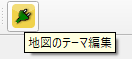

## ウィジェット画面詳細

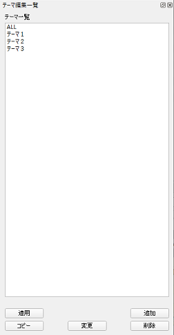 

|    |    |
| ---- | ---- |
| テーマ一覧 | QGISプロジェクトが保持している地図のテーマ内容一覧 |
| 適用 | 一覧で選択したテーマを適用します |
| 追加 | 現在の状態でテーマを追加します |
| コピー | 一覧で選択したテーマをコピーします |
| 削除 | 一覧で選択したテーマを削除します |
| 保存 | 一覧で選択したテーマを現在の状態で保存（変更）します |

※一覧内容はレイヤ欄と一致します。（下記はサンプルです）

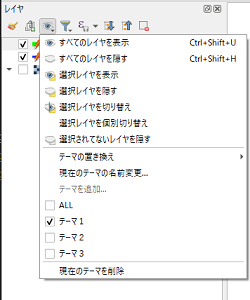

## 適用

適用前（地図は[地理院地図](http://cyberjapandata.gsi.go.jp/)）

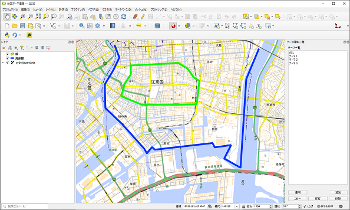

ここでは、レイヤ選択状態を例としています。 
「テーマ２」を選択し「適用」ボタンをクリックします。すると、"海岸線"レイヤのみが表示されます。

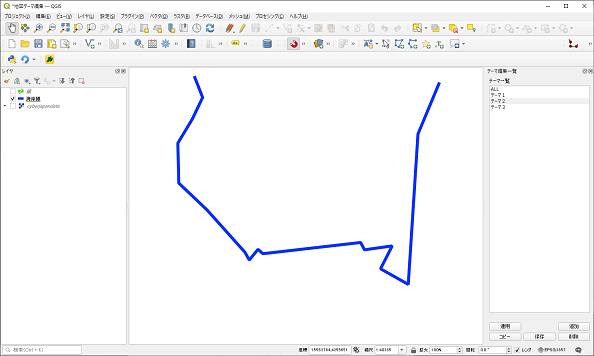

「テーマ３」を選択し「適用」ボタンをクリックします。すると、基盤地図レイヤのみが表示されます。

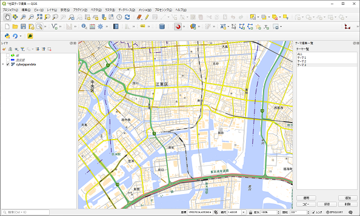

## 追加

「追加」ボタンをクリックすると、下記のような入力ダイアログが表示されます。

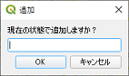

テーマ名を記入して、「OK」ボタンをクリックすると、下記のように追加されます。

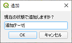

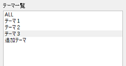

未入力の場合は、下記のようなエラーメッセージが表示されます。

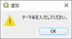

## コピー

テーマを選択し「コピー」ボタンをクリックすると、下記のような入力ダイアログが表示されます。

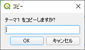

テーマ名を記入して、「OK」ボタンをクリックすると、下記のように追加されます。

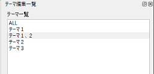

## 削除

テーマを選択し「削除」ボタンをクリックすると、下記のような入力ダイアログが表示されます。

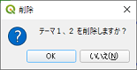

「OK」ボタンをクリックすると、下記のように削除されます。

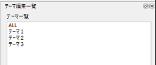

## 保存

レイヤの表示状態を変更し、テーマを選択し「保存」ボタンをクリックすると、下記のような入力ダイアログが表示されます。

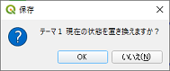

「OK」ボタンをクリックすると、内容が変更されます。

## QGIS側の操作とも連動

QGIS側の操作で、テーマを追加・削除などをすると、本プラグインのウィジェット画面にも反映されます。 
例）追加

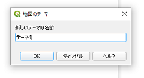

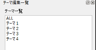

## プロジェクト変更

プロジェクトを変更すると、テーマ一覧も該当するテーマに変更されます。
 
下記は新規にした場合

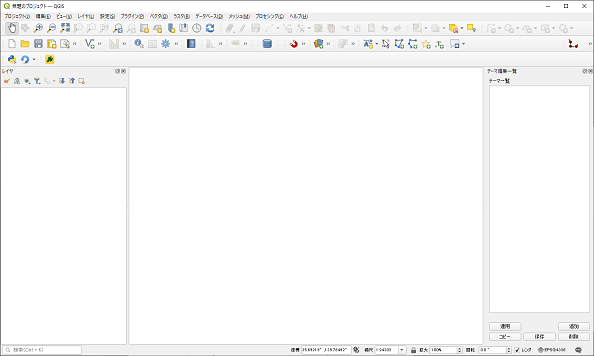
