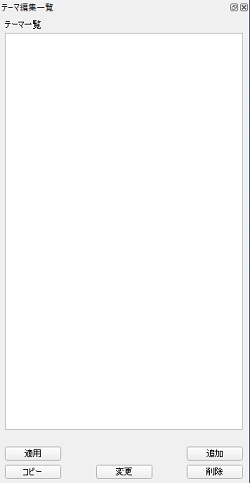

# 地図テーマ編集プラグイン

作成されている地図のテーマを編集するQGISプラグインです。

## 概要

### ウィジェット画面

### テーマ一覧と適用例

適用前（地図は[地理院地図](http://cyberjapandata.gsi.go.jp/)）

"線"レイヤのみを表示するテーマを適用

## 利用方法

利用方法については、[使い方](./MANUAL.md)をご確認ください。

## ライセンス

本ツールは GNU GENERAL PUBLIC LICENSE v2 ライセンスが設定されています。[GNU GENERAL PUBLIC LICENSE Version 2, June 1991](https://www.gnu.org/licenses/old-licenses/gpl-2.0.txt)